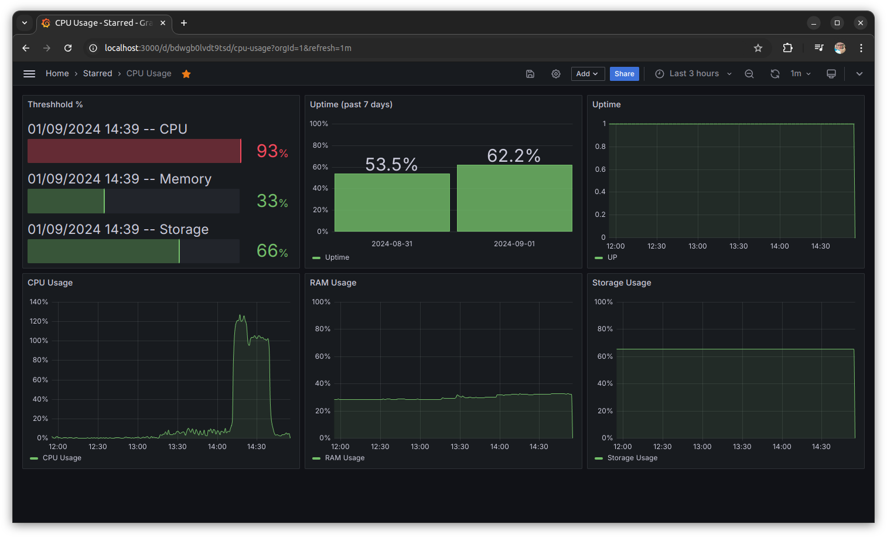

# node-uptime-local

This project is intended to record the uptime and resources usage of a Ubuntu server in local database and display it in Grafana. 

I have created another project to centralized monitoring of uptime and resources of remote servers. But with this simple project you will get the idea of how it works.




# Dependencies

1. Ubuntu Linux
2. MySQL
3. Git
4. NodeJS with mysql2, check-disk-space
5. Grafana


# Installation

### 1. MySQL

To install mysql in Ubuntu:

```
sudo apt install mysql-server
```

Disable ONLY_FULL_GROUP in sql_mode:

```
SET GLOBAL sql_mode=(SELECT REPLACE(@@sql_mode,'ONLY_FULL_GROUP_BY',''));
```

Set the change to persistent:

```
SET PERSIST sql_mode=(SELECT REPLACE(@@sql_mode,'ONLY_FULL_GROUP_BY',''));
```

Don't forget to restart MySQL:

```
sudo systemctl restart mysql
```

Note: disabling ONLY_FULL_GROUP is needed in order to run query in Grafana

### 2. NodeJS

To install nodejs in Ubuntu:

```
sudo apt install nodejs
```

### 3. Install Git

To install git in Ubuntu:

```
sudo apt install git
```

### 4. Install Grafana

To install Grafana, follow the instruction from this source:

https://grafana.com/docs/grafana/latest/setup-grafana/installation/


# Install node-uptime-local

Clone repository:

```
git clone git@github.com:setiodewo/node-uptime-local
```

Enter the folder:

```
cd node-uptime-local
```

Find structure.sql and execute in mysql:

```
sudo mysql
source structure.sql
```

In `structure.sql` we also create username and password for this project in order to access database. You can alter the database name, username and password in this file as you want.

We use `caching_sha2_password` for mysql user authentication since mysql_native_password plugin is disabled in newer version of MySQL.

Install dependencies:

```
npm install
```

Try run the script and check if there are any error messages:

```
node uptime.js
```


# Create Cronjob

Go to /etc/cron.d :

```
cd /etc/cron.d
```

Create a file:

```
sudo nano uptime
```

Paste this line:

```
* *     * * *   dewo    node /home/dewo/projects/node-uptime-local/uptime.js >/dev/null 2>&1
```

Save with `Ctrl+O`. Exit with `Ctrl+X`.


# Setup in Grafana

1. Go to http://localhost:3000

2. Login with username admin, password admin. Change the admin's password.

3. Create mysql connection to connect uptime database. Host: localhost:3306, Username: uptime, Password: upt1m3_local, the same as username we created from `structure.sql`.

4. Create dashboard, named it `CPU Usage`.

5. Create first visualization. Named it as `Uptime (past 7 days)`. Set the chart as Bar Chart. Enter this code in query editor:
```
select LEFT(timestamp, 10) as name,
count(distinct(left(timestamp, 16)))/14.40 as "Uptime"
from uptime.res
where timestamp >= now() - interval 7 day
group by 1
```

6. Create 2nd visualization. Named it as `Uptime`. Set the chart as Timeseries. Enter this code in query editor:
```
select $__timeGroup(timestamp, '1m') as time,
if (count(id) >= 1, 1, 0) as "UP"
from uptime.res
where $__timeFilter(timestamp) 
group by 1
```

7. Create 3rd visualization. Named it as `CPU Usage`. Set the chart as Timeseries. Enter this code in query editor:
```
select $__timeGroup(timestamp, '1m') as time, (loadavgnow / cpucount * 100) as "CPU Usage"
from uptime.res
where $__timeFilter(timestamp)
group by time
```

8. Create 4th visualization. Named it as `RAM Usage`. Set the chart as Timeseries. Enter this code in query editor:
```
select $__timeGroup(timestamp, '1m') as time,
((totalmem - freemem) / totalmem * 100) as "RAM Usage"
from uptime.res
where $__timeFilter(timestamp) 
group by 1
```

9. Create 5th visualization. Named it as `Storage Usage`. Set the chart as Timeseries. Enter this code in query editor:
```
select $__timeGroup(timestamp, '1m') as time,
((storagesize - storagefree)/storagesize * 100) as "Storage Usage"
from uptime.res
group by 1
```

10. Create 6th visualization. Named it as `Threshhold`. Set the chart as Bar Gauge. Enter this code in query editor:
```
select date_format(timestamp, '%d/%m/%Y %H:%i --') as 'Time', value_cpu as 'CPU', value_memory as 'Memory', value_storage as 'Storage'
from uptime.ambang
where $__timeFilter(timestamp)
order by id desc limit 1
```

11. Arrange all visualizations as you want.

12. Set time filter in dashboard to `Last 6 hours` and auto refresh the dashboard every `1 minute`.


# What's next?

1. Monitoring remote servers centralized.

2. Monitoring resources' threshhold.

3. Alert when resources' measurements are exceeding threshhold.